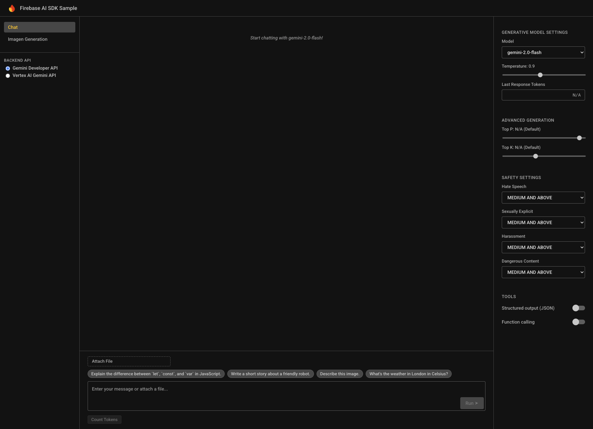

# Firebase AI Logic Sample App



This sample application demonstrates features of the Firebase AI SDK for Web (`firebase/ai`), integrated into a web application built with React and TypeScript.

For more information about the Firebase AI SDK, see the [Firebase AI Logic Docs](https://firebase.google.com/docs/ai-logic).

## Setup Instructions

1. Use the guided workflow in the [Firebase AI Logic page](https://console.firebase.google.com/project/_/ailogic?_gl=1*dps5w8*_ga*NDk4MDUyODg4LjE3NDc4NTIwMDA.*_ga_CW55HF8NVT*czE3NDc5MzE2NzQkbzIkZzEkdDE3NDc5MzE3MjEkajEzJGwwJGgwJGRjVEhnTE1XMmtOQURjUXFPa18zZlRTU2JIblVCY0tTenN3) of the Firebase Console to setup your project (including enabling the required APIs for your chosen Gemini API provider), then register your app with your Firebase project.

1. Update `src/config/firebase-config.ts` with your Firebase configuration.

1. Install dependencies:

   ```bash
   yarn
   ```

1. Start the development server:

   ```bash
   yarn dev
   ```

## Support

- [Firebase Support](https://firebase.google.com/support/)

## License

© Google, 2025. Licensed under an [Apache-2](../LICENSE)
