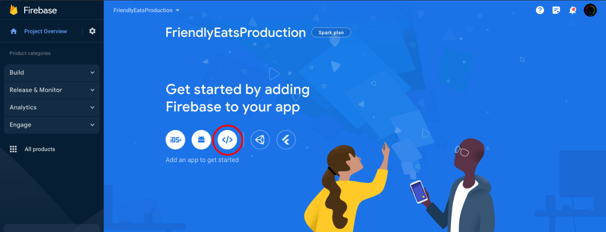
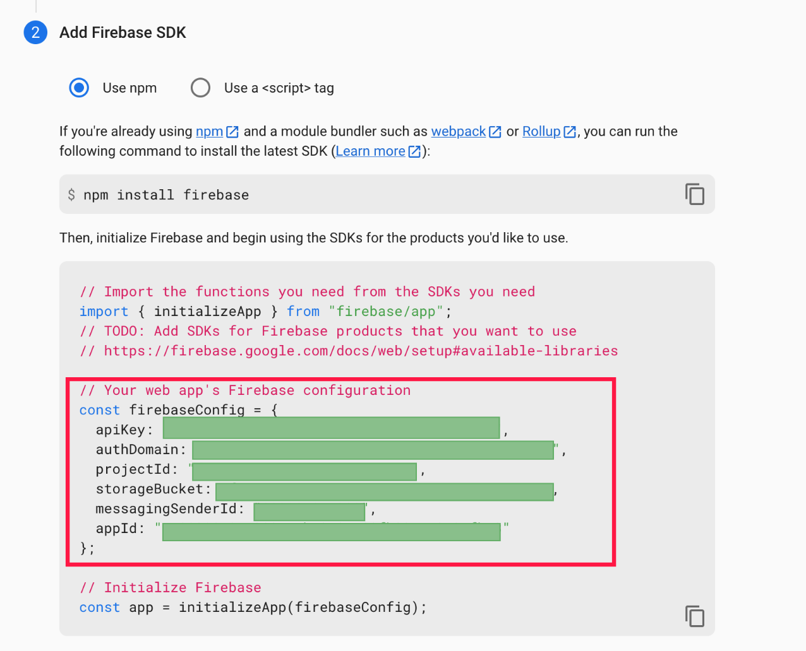
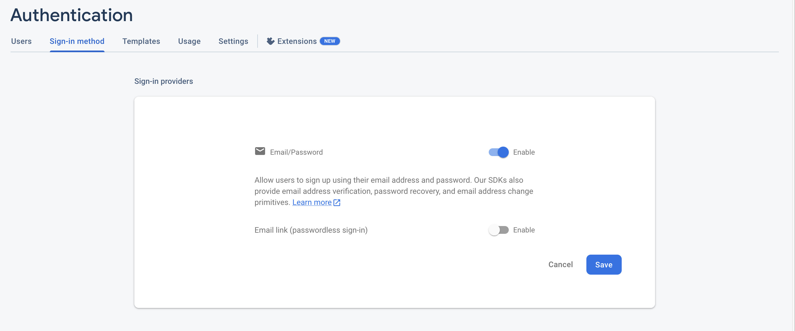
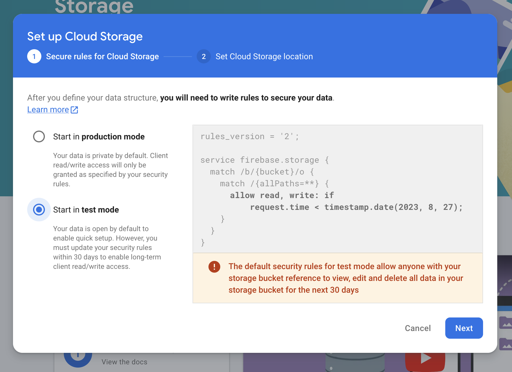

# Firestore Quickstart: Friendly Eats


## Introduction

FriendlyEats is a restaurant recommendation app built on Firestore. It was built with the [Angular](https://angular.io/) Javascript framework, and can make use of [Firebase's Local Emulator Suite][emulator-docs] (specifically, the [Authentication](https://firebase.google.com/docs/emulator-suite/connect_auth), [Storage](https://firebase.google.com/docs/emulator-suite/connect_storage), [Functions](https://firebase.google.com/docs/emulator-suite/connect_functions), and [Firestore](https://firebase.google.com/docs/emulator-suite/connect_firestore) emulators) so that the quickstart can be run without needing to create a project in the [Firebase Console](https://console.firebase.google.com).

For more information about Firestore visit the [Firestore docs][firestore-docs].

For more information about the Firebase Emulator Suite visit the [Emulator Suite docs][emulator-docs]

[firestore-docs]: https://firebase.google.com/docs/firestore/
[emulator-docs]: https://firebase.google.com/docs/emulator-suite

## Prerequisites
Before following the steps to build and run this quickstart you will need:
 1. [Node.Js](https://nodejs.org/en/download) Version 16.0 or higher
 2. [Java](https://jdk.java.net/) JDK version 11 or higher.

## Configure and run the app locally with emulators:

Follow these steps to setup and run the quickstart:

 1. Install the Angular CLI if you do not already have it installed on your machine:
    ``` bash
    npm install -g @angular/cli
    ```

 1. Install the Firebase CLI if you do not have it installed on your machine:
    ```bash
    npm -g i firebase-tools
    ```

 1. Install and build all project dependencies
    ```bash
    npm install && (cd functions && npm install)
    ```

    > **Note:** When modifying the contents of `functions/src`, be sure to run `npm run build` in the `functions/` directory so that Typescript changes can be compiled and present in the next emulator run.

 1. Run and serve the project locally:
    ```bash
    npm start
    ```
 1. Open [http://localhost:4200](http://localhost:4200) in your browser and try out the app!

## Configure and run the app with the Firebase Console:

Follow these steps to have a working version of the quickstart running with the Firebase console:

   > **Note:** In the original application (that runs on the emulators), there is a Firebase Function that updates the `avgRating` field of a restaurant whenever that restaurant recieves a review. While **Authentication**, **Storage**, and **Firestore** are offered as free services through the Firebase console, using Firebase **Functions** on the Firebase Console requires a billing plan. There is a [free tier billing plan](https://firebase.google.com/pricing) that allows up to 2 million free function calls per month, but enabling this plan requires presenting payment information to Firebase. The following instructions, therefore, exclude those steps needed to deploy and host functions on the Firebase Console. All application functionality, other than the auto-updating `avgRating` field for restaurants, is conserved.

 1. Create a new Firebase project in the [Firebase Console](https://console.firebase.google.com)

 2. On the project homepage, select `Web` under `Get Started By Adding Firebase To Your App` and follow prompts to create your app, making sure to **copy the `firebaseConfig` object** when presented.
 
 

 

 3. With the `firebaseConfig` copied, navigate to `src/environments/environments.prod.ts` and paste the contents of the object into the `environment` object:

 

 4. Back in the Firebase console, enable email and password authentication on your project by doing: **Authentication > SIGN-IN METHOD > Email > Email/Password > SAVE**

 

 5. In the Firebase console, enable Firestore on your project by clicking **Create Database** in the **Cloud Firestore** section of the console and answering all prompts.

   * When prompted, select "Start in Test Mode"

 

 6. Simmilarly, enable Cloud Storage on your project by clicking **Get Started** in the **Storage** section of the console and answering all prompts.

   * When prompted, select "Start in Test Mode"

 

 7. Set the CLI to use the project you created in Step 1:

 ```bash
 firebase --use add
 ```

 8. Serve your Angular app and see it connect to the Firebase Console by opening [http://localhost:4200](http://localhost:4200) in your browser!

 ```bash
 npm run production
 ```
 > **Note:** If you've opted to set up a billing plan and wish to deploy functions as well, replace the `firebase deploy --only firestore` on line 8 of `package.json` with `firebase deploy`.

 11. (Optional) Populate production Firestore with mock data

 Now that the application is live on the Firebase console, you likely want to add some data to your production Firestore database so that you can see the application in action. Rather than manually adding restaurants and reviews, a convenice script is available to populate your production Firestore database. Run the following command (defined in the `Firestore/` directory's `package.json`) to add mock data:

 ```bash
 npm run populate-production
 ```

 > **Note:** To ensure that the script runs as intended, make sure that you have correctly populated the `environemnt.prod.ts` file with your Firebase credentials.
 
## Support

- [Firebase Support](https://firebase.google.com/support/)

## License

© Google, 2023. Licensed under an [Apache-2](../LICENSE) license.
